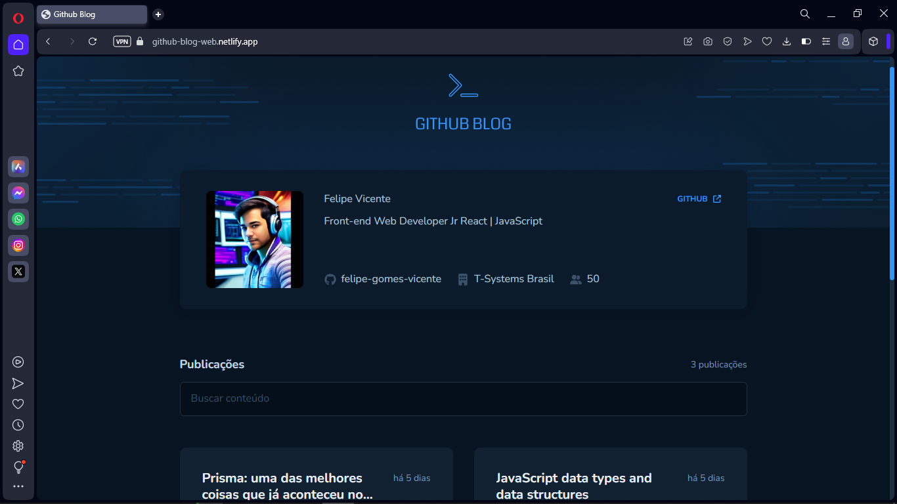

# GitHub Blog

<h1 align="center">
    
</h1>

<br>

### 💻 GitHub Blog

 It's a project made in React of a blog where the issues of a repository are the posts, that is, you can create a repository on your GitHub with the name "blog" for example, and the issues of it will be the posts. This project was made with the intention of improving the use and consumption of the API using this time the GitHub API with Axios, in addition to using React Markdown to format the code in GitHub markdown.

Watch it in action Deploy: [Click Here](https://github-blog-web.netlify.app)

What was developed:

- Logic and Algorithms with Javascript;
- Deploy Front end Netlify;
- Advancing in WEB Programming with ReactJS and Javascript;
- States, state immutability and properties;
- Routes and React Router DOM;
- components;
- Hooks;
- Mobile version;
- Profile listing with image, number of followers, name and other information available via the GitHub API;
- Lists and filters all repository issues with a short summary of their content;
- Create a page to display a complete post (issue);
- 
- Manipulating the DOM, Objects, Arrays and Events;
- Functions Callback;
- Working with colors and fonts;
- Applying spacing, aligning and positioning text and elements;
- File system structure of the project separated by folder;  
<br />

## 🧪 Tools

Application developed using the following tools:

- Vite
- ReactJS
- Typescript
- ESLint
- Styled-components
- React Router Dom
- React Hook Form (@hookform/resolvers)
- Form validations with Zod
- Moment
- Axios
- React Markdown (react-syntax-highlighter)
  
  <br />
  
- [Design Figma - GitHub Blog](https://www.figma.com/community/file/1138814951106121051)

## Coffee Delivery three screens:
 

 <br />

## 🚀 Getting started

Live server with VScode or just clone folder and access index.html

### Programs needed to Getting started

- [NodeJS](https://nodejs.org/en/)
- [Visual Studio Code - Vscode](https://code.visualstudio.com/)
- [Git](https://git-scm.com/)

Clone the project and access the folder

```bash
  # Clone this repository
  $ git clone https://github.com/felipe-gomes-vicente/github-blog.git

  # Access the project folder in your terminal
  $ cd github-blog

  # Install the dependencies
  $ npm install

  # Run the application in development mode
  $ npm run dev

  # The application will open on the port: 5173 - go to http://localhost:5173/ or http://127.0.0.1:5173/ 
```


## 📝 License

This project is under the MIT license. See the file [LICENSE](LICENSE) for more details.

---

&nbsp;

<p align="center">Done with 💜 by Felipe Vicente👋</p>

- ## My LinkedIn - [](https://www.linkedin.com/in/felipe-gomes-vicente/)